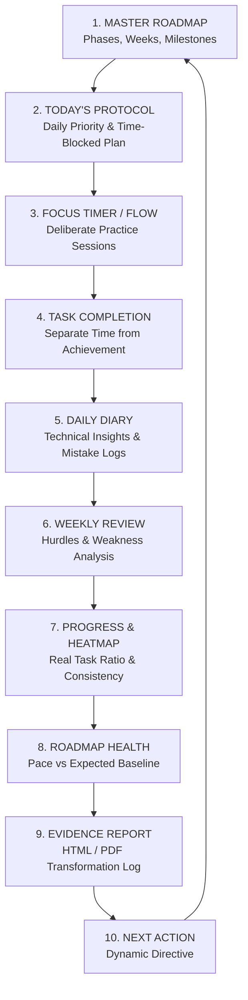

# 🎯 QA → SDET Learning Command Center & Test Automation Lab

[](https://github.com/DevangBChauhan/TO-DO/actions/workflows/test.yml)
[](https://project2-0-chi.vercel.app)
[](https://playwright.dev)
[](https://opensource.org/licenses/MIT)

> **A measurable daily execution system and automated testing laboratory designed to convert a long-term QA → Automation QA → SDET career roadmap into structured, evidence-backed mastery.**

---

## 🌐 Live Production Demo
👉 **[https://project2-0-chi.vercel.app](https://project2-0-chi.vercel.app)**

---

## 🔄 The Closed-Loop Execution System



---

## 🛠️ Tech Stack & Architecture

### **Frontend & Application Layer**
- **Core**: React 19, Vite, Vanilla CSS Design System with CSS Variables (Deep Dark & Clean Light Themes)
- **State Management**: Reactive Context API (`AppContext.jsx`) with automatic JSON Schema `localStorage` persistence
- **Calculations & Telemetry**: Pure functional progress calculators (`progressUtils.js`) and aggregated report compiler (`reportUtils.js`)

### **Test Automation & Quality Assurance**
- **Framework**: [Playwright](https://playwright.dev/) with **Page Object Model (POM)** pattern
- **Browsers Tested**: Chromium, Firefox, WebKit (Safari), and Mobile Viewports (Pixel 5, iPhone 12)
- **CI/CD**: GitHub Actions automated pipeline executing E2E test suites on every push/PR

---

## 📁 Repository Structure

```text
├── .github/workflows/
│   └── test.yml                 # GitHub Actions CI/CD Pipeline
├── tests/
│   ├── pages/                   # Page Object Model (POM) Classes
│   │   ├── BasePage.js          # Navigation, Header, Theme controls
│   │   ├── DashboardPage.js     # KPI telemetry & Next Action card
│   │   ├── RoadmapPage.js       # Phase CRUD & Week task checklists
│   │   ├── TodayPage.js         # Daily protocol & time-slot filters
│   │   ├── FocusPage.js         # Countdown clock & stopwatch flow
│   │   └── DiaryPage.js         # 6 reflection prompt inputs & history
│   └── e2e/                     # End-to-End Automated Test Suites
│       ├── dashboard.spec.js    # Dashboard telemetry assertions
│       ├── roadmap.spec.js      # Roadmap phase math & task checks
│       ├── today.spec.js        # Time slot creation & filters
│       ├── focus.spec.js        # Timer countdown & mode switches
│       ├── diary.spec.js        # Diary reflections & persistence
│       └── reports.spec.js      # Evidence report generation modal
├── src/
│   ├── components/              # Modular UI widgets, timers, reports
│   ├── context/                 # Reactive AppContext & state mutators
│   ├── pages/                   # Main view routes
│   └── utils/                   # Progress math & HTML report generator
├── playwright.config.js         # Multi-browser Playwright configuration
├── vercel.json                  # Production SPA rewrite rules
└── package.json                 # Project dependencies and test scripts
```

---

## 🚀 Getting Started

### 1. Clone the repository
```bash
git clone https://github.com/DevangBChauhan/TO-DO.git
cd TO-DO
```

### 2. Install dependencies
```bash
npm install
```

### 3. Run development server
```bash
npm run dev
```
Open **`http://localhost:5173/`** to view the app.

---

## 🧪 Running Automated Tests

### Run all Playwright E2E Tests (Headless)
```bash
npm run test:e2e
```

### Run Tests in Interactive UI Mode
```bash
npm run test:ui
```

### View HTML Test Execution Report
```bash
npm run test:report
```

---

## 📄 License
This project is open-source and available under the [MIT License](LICENSE).
